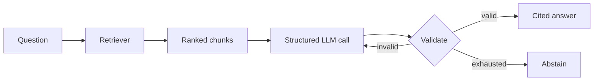

# RAG Agent with Citation Validation

[](https://github.com/Ramesh-Murala/RAG-Agent-with-Citation/actions/workflows/ci.yml)

A reproducible RAG reliability project that compares retrieval strategies, validates citation provenance and verbatim evidence, retries invalid model output, and abstains when no context is retrieved.

The project is deliberately inspectable: the benchmark makes no API calls, the browser demo exposes every retrieved chunk and score, and the documentation separates measured behavior from production claims.

## Measured results

The committed benchmark contains **20 synthetic policy documents, 60 labeled answerable questions, and 12 unanswerable questions**. It includes exact queries and paraphrases. Results below were produced locally from [`evaluation/results.json`](evaluation/results.json):

| Retrieval strategy | Top-1 accuracy | Recall@3 | MRR@3 | Median query time* |
|---|---:|---:|---:|---:|
| TF-IDF | 66.7% | 80.0% | 72.5% | 0.310 ms |
| BM25 | 70.0% | 80.0% | 74.4% | 0.048 ms |
| Dense LSA | 65.0% | 80.0% | 71.9% | 0.537 ms |
| Hybrid | 70.0% | 85.0% | 76.7% | 0.641 ms |
| **Hybrid + rerank** | **70.0%** | **88.3%** | **77.2%** | 0.712 ms |

\*Single-process local measurement, excluding generation. Timing varies by machine.

The hybrid + rerank baseline improved Recall@3 by **8.3 percentage points** over TF-IDF on this fixture. This is a synthetic, single-relevant-document benchmark. It is useful for regression detection and design comparison; it is not a production quality estimate.

`DenseLSARetriever` uses TF-IDF plus truncated SVD trained on the local corpus. It is a dense latent-semantic baseline, not a pretrained neural embedding model. The reranker is a transparent query-coverage heuristic, not a cross-encoder.

## Architecture



Retrieval implementations share one interface:

- **TF-IDF:** word and bigram lexical baseline.
- **BM25:** length-normalized term scoring.
- **Dense LSA:** local low-dimensional semantic representation.
- **Hybrid:** reciprocal-rank fusion of BM25 and dense LSA.
- **Hybrid + rerank:** fusion followed by query-coverage reranking.

The agent then asks the model for a Pydantic-validated response and deterministically checks:

| Check | Enforced behavior |
|---|---|
| Retrieved chunk ID | Reject citations outside the current retrieval context |
| Source attribution | Require source and chunk ID to agree |
| Quoted evidence | Require a verbatim 1–19 word excerpt from the cited chunk |
| Grounded response | Require at least one citation |
| Missing context | Abstain without a generation call |
| Invalid model output | Retry with validation feedback, within a fixed budget |

A real quote can accompany a false claim. The project tests and documents that boundary; citation integrity does not prove entailment.

## Run the benchmark

Python 3.11 or 3.12:

```bash
python -m venv .venv
source .venv/bin/activate  # Windows: .venv\Scripts\Activate.ps1
pip install -r requirements-dev.txt
pytest -q
python -m evaluation.run --output evaluation/results.json --summary
```

The tests and retrieval evaluation require no credentials and make no model calls. CI runs them on Python 3.11 and 3.12 and uploads the full result artifact.

## Inspect the browser demo

```bash
python demo_app.py
```

Open `http://127.0.0.1:8000`. Choose a retrieval strategy, ask a question, and inspect ranked sources, chunk IDs, raw scores, and latency. The demo intentionally stops at retrieval so reviewers can evaluate evidence without an API key or model cost.

For live cited generation, set `ANTHROPIC_API_KEY` and run:

```bash
python example.py
```

## Repository map

| Path | Purpose |
|---|---|
| [`vectorstore.py`](vectorstore.py) | Five retrieval configurations behind one protocol |
| [`agent.py`](agent.py) | Structured generation, citation validation, retry, confidence, and fallback |
| [`evaluation/cases.json`](evaluation/cases.json) | Versioned documents and 72 labeled questions |
| [`evaluation/run.py`](evaluation/run.py) | Recall, ranking, latency, and citation-integrity evaluation |
| [`demo_app.py`](demo_app.py) | Dependency-free evidence inspection UI and JSON endpoint |
| [`tests/`](tests) | Retrieval and failure-path regression tests |
| [`docs/interview-walkthrough.md`](docs/interview-walkthrough.md) | Architecture and trade-off discussion guide |

## Boundaries and next experiments

- The confidence blend is a heuristic, not a calibrated probability.
- No-result rate on unanswerable queries is reported separately; score scales differ, so the project does not claim a universal abstention threshold.
- Provider errors and fallback-search failures propagate to the caller.
- Attempt records contain raw model output and need a data-retention policy before production use.
- A useful next comparison is a pinned pretrained embedding model plus a cross-encoder, evaluated on a larger held-out domain dataset.
