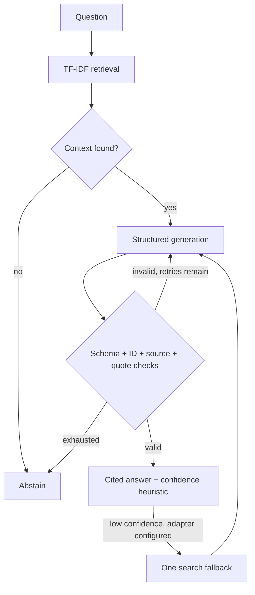
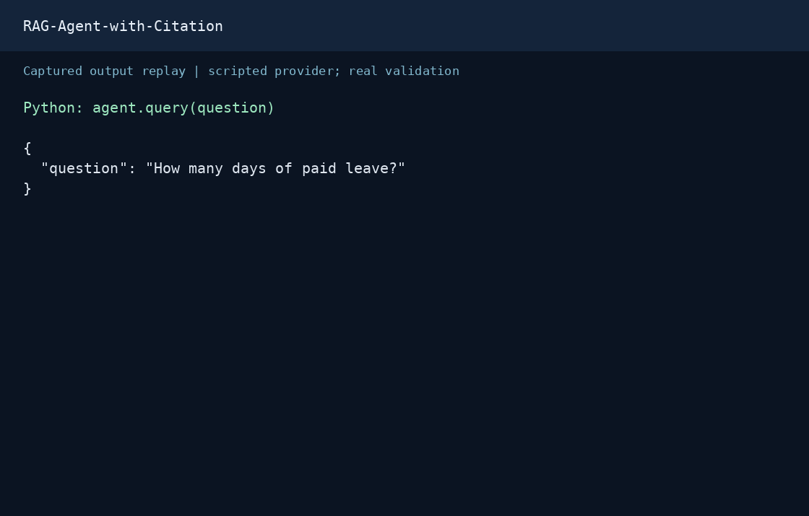

# RAG Agent with Citation Validation

[](https://github.com/Ramesh-Murala/RAG-Agent-with-Citation/actions/workflows/ci.yml)

A Python RAG prototype that checks citation provenance, verifies quoted text against retrieved documents, retries invalid responses, and abstains when no context is found.

**Scope:** a small, inspectable reliability experiment. It does not establish that every generated claim is true, and has not been validated at production scale.


## Visual proof

### Architecture



### Request and response replay



This GIF renders actual captured JSON as an animated transcript; it is not a screen recording. Python API: `agent.query("How many days of paid leave?")`. Generation uses a scripted client; retrieval and citation validation run normally. The result below selects public result fields. No HTTP endpoint is implied. Any `latency_ms` is a single local sample, not a performance benchmark.

### Evaluation results

| Measure | Recorded result |
|---|---:|
| Fictional documents | 6 |
| Answerable / unanswerable queries | 12 / 2 |
| Recall@3 | 0.8333 |
| MRR@3 | 0.8333 |
| Empty retrieval on unanswerable queries | 2/2 |
| Citation-check cases matching expected behavior | 6/6 |

[Recorded evaluation](evaluation/results.json). A tiny hand-authored fixture, not a production quality estimate. Two paraphrases are missed. One test explicitly shows a false answer passing with a real quote.

### Sample request

```json
{
  "question": "How many days of paid leave?"
}
```

### Captured response

```json
{
  "answer": {
    "answer": "Employees receive 20 days of paid leave each year.",
    "citations": [
      {
        "source": "handbook",
        "chunk_id": "leave",
        "supporting_quote": "20 days of paid leave"
      }
    ],
    "self_reported_confidence": 0.9,
    "grounded": true
  },
  "final_confidence": 0.814,
  "is_low_confidence": false,
  "used_fallback": false,
  "attempt_count": 1
}
```

Reproduce the capture and GIF from the repository root:

```bash
pip install -r requirements-dev.txt pillow
python docs/capture_demo.py
python docs/render_replay.py
```

The renderer needs DejaVu Sans Mono (on Debian/Ubuntu: `fonts-dejavu-core`). [Capture metadata](docs/assets/capture.json) records the source revision. [Request JSON](docs/assets/request.json) and [response JSON](docs/assets/response.json) are available separately.

## What the code checks

| Check | Behavior |
|---|---|
| Retrieved chunk ID | Reject citations to chunks outside the current context |
| Source attribution | Require the citation source to match the retrieved chunk |
| Quoted evidence | Require a nonempty, verbatim 1–19 word quote; normalize whitespace |
| Grounded flag | A response marked grounded must include a citation |
| Missing context | Abstain without spending a generation call; optionally try the search adapter |
| Invalid output | Send validation feedback to the model, with a bounded retry budget |

A valid quote can still accompany an incorrect answer. The test `test_valid_quote_does_not_prove_answer_entailment` deliberately demonstrates this limitation. The model's `grounded` flag is self-reported, not an independent fact check.

## Architecture

1. `TfidfRetriever` ranks in-memory chunks by lexical similarity.
2. `RAGCitationAgent` requests a structured answer using an Anthropic tool schema.
3. Pydantic validates the response, followed by source and quote checks.
4. Failed checks trigger corrective generation; exhaustion returns an ungrounded response.
5. A low confidence score may invoke one optional search callback. New evidence goes through the same validation.

TF-IDF is a reproducible offline baseline. It can miss paraphrases without overlapping words. The store is not persistent, and this repository does not implement embedding search, reranking, or a hosted API.

## Run locally

Python 3.11 or 3.12:

```bash
python -m venv .venv
source .venv/bin/activate  # Windows: .venv\Scripts\Activate.ps1
pip install -r requirements-dev.txt
pytest -q
python -m evaluation.run --output evaluation/results.json
```

The tests and evaluation require no credentials and make no model calls.

For the live generation example, set `ANTHROPIC_API_KEY` in your environment and run `python example.py`. Live generation uses the configured model and incurs provider charges. The example's search fallback returns canned data; it is not a web search integration.

## Reproducible evaluation

[`evaluation/cases.json`](evaluation/cases.json) contains six fictional policy documents, twelve answerable queries (including paraphrases), and two unanswerable queries. [`evaluation/results.json`](evaluation/results.json) records:

- Recall@3 and MRR@3 over answerable queries.
- Empty retrieval rate on the two unanswerable queries, not end-to-end abstention accuracy.
- Citation checks for invented IDs, wrong sources, fabricated quotes, and missing citations.
- A counterexample where a false answer passes the structural checks using a real quote.

The corpus is a hand-authored smoke benchmark, not a representative quality estimate. CI runs tests and publishes the evaluation JSON for Python 3.11 and 3.12.

## Confidence and failure boundaries

`0.35 * retrieval_score + 0.65 * self_reported_confidence` is an uncalibrated heuristic. Scores are capped for ungrounded or uncited responses. A high score does not prove accuracy. A low score is a signal for review or fallback.

Provider transport errors and search-adapter exceptions propagate to the caller. The retry budget handles malformed/invalid answers, not availability failures. Callers must supply timeout and service-level error handling. Attempt records contain raw model outputs; do not persist them without a data-handling policy. Treat retrieved text as untrusted: the prompt discourages following document instructions, but this is not a prompt-injection defense guarantee.

## Next engineering milestones

- Compare TF-IDF with dense and hybrid retrieval on a larger labeled corpus.
- Evaluate claim-to-evidence entailment separately from quote integrity.
- Calibrate abstention thresholds; report false acceptance and false rejection.
- Measure live-model latency, token usage, and cost before making deployment claims.
